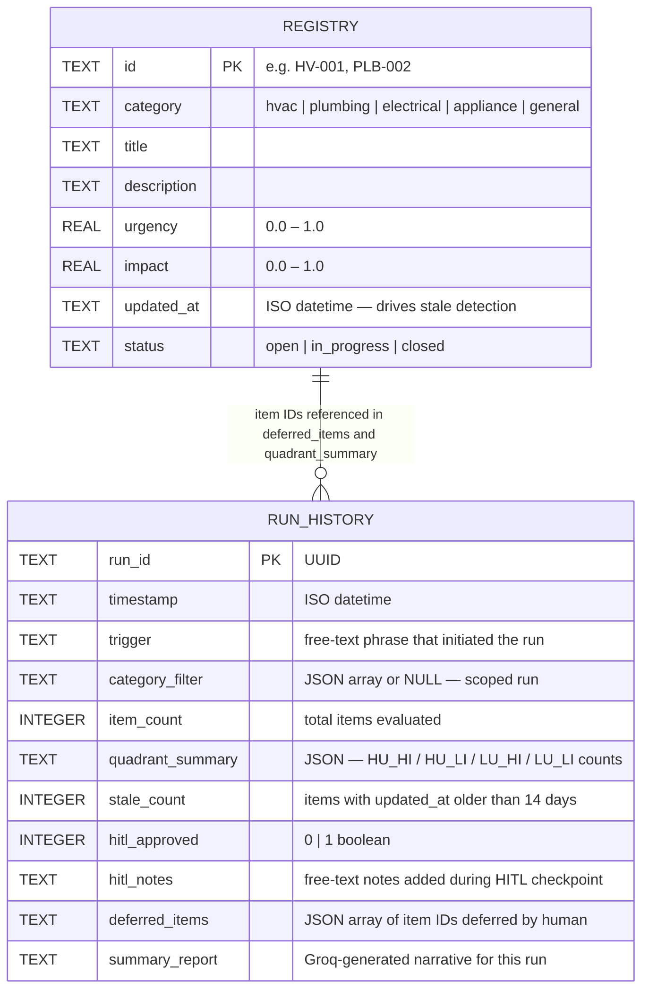

# HOMEBASE — Entity Relationship Diagram

> **Proof of Concept Notice**
> This diagram and the HOMEBASE system it represents are provided as a proof of concept for
> demonstration purposes only. This codebase has not undergone formal code review, security
> assessment, penetration testing, or production hardening. It should not be deployed in a
> production environment or used to process real sensitive data without a full security review,
> compliance evaluation, and architectural assessment appropriate to the target environment.

