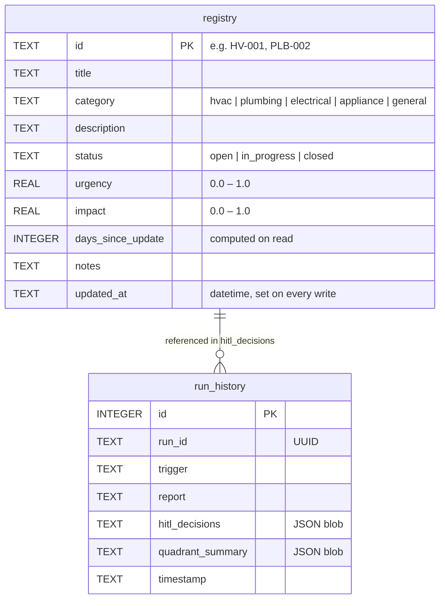

# Data Model

## Entity Relationship Diagram

---

## `registry` Table

| Column | Type | Notes |
|---|---|---|
| `id` | TEXT | Primary key. Format: `{PREFIX}-{NNN}` — e.g. `HV-001`, `PLB-002`, `EL-003` |
| `title` | TEXT | Short label for the item |
| `category` | TEXT | One of: `hvac`, `plumbing`, `electrical`, `appliance`, `general` |
| `description` | TEXT | Free-text description of the issue or task |
| `status` | TEXT | One of: `open`, `in_progress`, `closed` |
| `urgency` | REAL | 0.0–1.0 score assigned by orchestrator |
| `impact` | REAL | 0.0–1.0 score assigned by orchestrator |
| `days_since_update` | INTEGER | Computed on read via `julianday()` diff from `updated_at` |
| `notes` | TEXT | Free-text notes; AI-proposed notes prefixed with agent tag (e.g. `[Analytics]`) |
| `updated_at` | TEXT | ISO datetime; set to `datetime('now')` on every write |

**Category prefixes:** `HV` (HVAC), `PLB` (plumbing), `EL` (electrical), `APL` (appliance), `GEN` (general)

**Stale threshold:** Items with `days_since_update >= 14` are flagged as stale regardless of quadrant.

---

## `run_history` Table

| Column | Type | Notes |
|---|---|---|
| `id` | INTEGER | Auto-increment primary key |
| `run_id` | TEXT | UUID assigned at run start |
| `trigger` | TEXT | The input phrase that initiated the run |
| `report` | TEXT | Full synthesizer-generated narrative |
| `hitl_decisions` | TEXT | JSON blob of approval/deferral decisions with notes |
| `quadrant_summary` | TEXT | JSON blob with HU/HI, HU/LI, LU/HI, LU/LI counts |
| `timestamp` | TEXT | ISO datetime of run completion |

---

## Notes

- `data/homebase.db` is created and seeded automatically on first run from `data/registry.json`
- After the DB exists, `registry.json` is never read again — all reads/writes go through SQLite
- Auto-migration on startup back-fills `updated_at` from legacy `days_since_update` integer values
  in databases created before v1.10.0
- `homebase_erd.md` in the project root contains this ERD as a standalone Mermaid file, usable
  as a test input for the Schema Metric Discovery agent's Mermaid parse path
